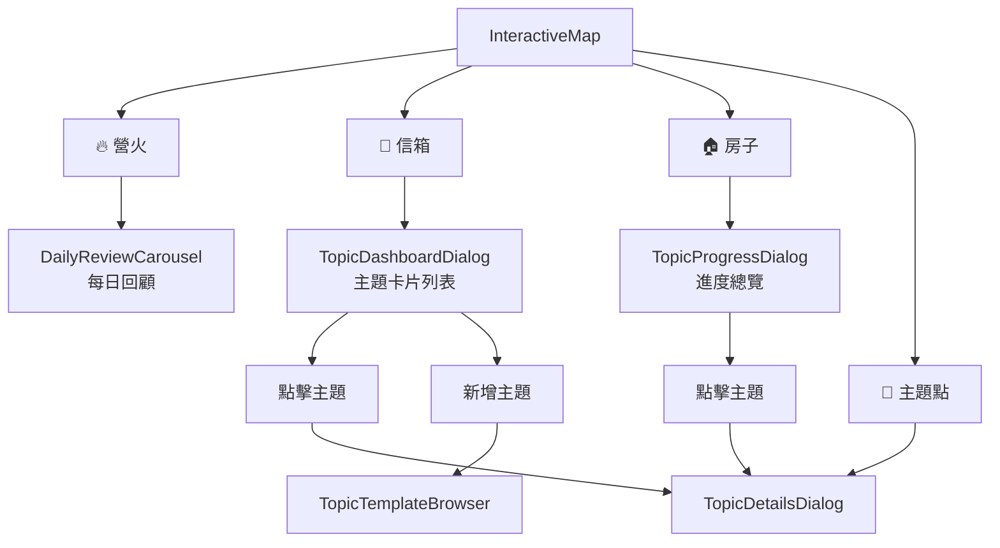
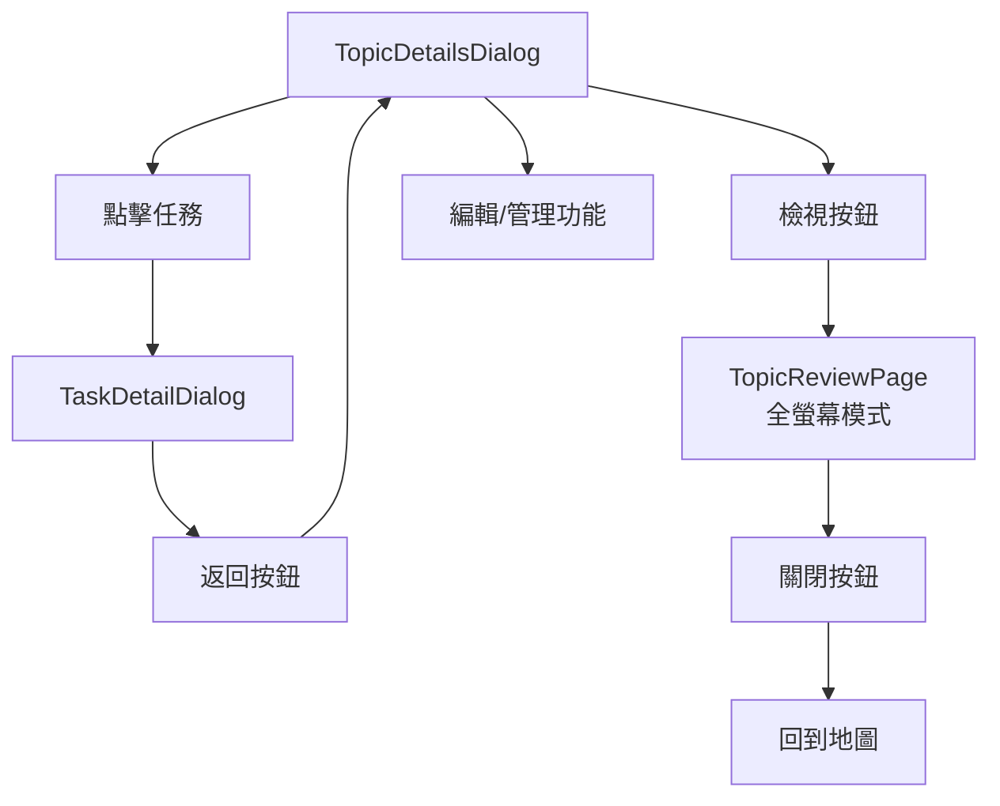
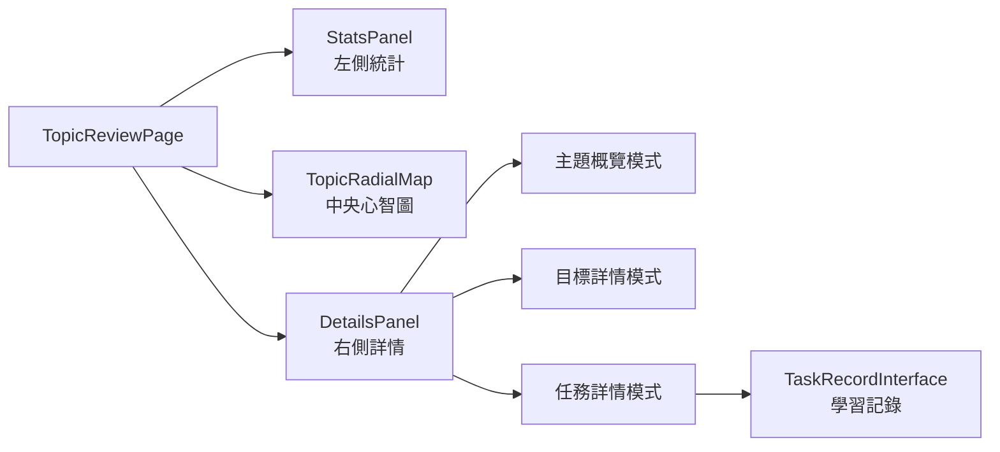

# 🗺️ 學習地圖架構文檔

## 📋 總覽

StudentLearningMap 是學習平台的核心頁面，管理所有主題、目標和任務的可視化展示與互動。

## 🎯 組件層次結構

```
StudentLearningMap (主頁面)
├── PageLayout
│   └── InteractiveMap (背景地圖)
│       ├── 🔥 營火 → DailyReviewCarousel
│       ├── 📮 信箱 → TopicDashboardDialog  
│       ├── 🏠 房子 → TopicProgressDialog
│       └── 📌 主題點 → TopicDetailsDialog
│
├── TopicTemplateBrowser (模板選擇器)
└── 多個浮動 Dialog (使用 DraggableDialog 包裝)
```

## 🔄 Dialog 流程與關係

### 1. 地圖直接操作路徑



### 2. TopicDetailsDialog 內部流程



### 3. TopicReviewPage 詳細結構



## 🎮 狀態管理

### Dialog 開關狀態

| 狀態變數 | 用途 | 對應組件 |
|---------|------|----------|
| `showDailyReview` | 每日回顧輪播 | DailyReviewCarousel |
| `showTopicCards` | 主題卡片面板 | TopicDashboardDialog |
| `showProgress` | 進度總覽面板 | TopicProgressDialog |
| `showTemplateBrowser` | 模板選擇器 | TopicTemplateBrowser |
| `showTopicReviewId` | 主題詳細檢視 | TopicReviewPage |

### 選擇狀態

| 狀態變數 | 用途 | 說明 |
|---------|------|------|
| `selectedTopicId` | 當前選中的主題 | 決定顯示哪個主題的詳情 |
| `selectedTaskId` | 當前選中的任務 | 決定顯示哪個任務的詳情 |
| `openedFromDashboard` | 是否從儀表板開啟 | 影響返回行為 |

### 位置狀態

| 狀態變數 | 用途 | 說明 |
|---------|------|------|
| `mapRect` | 地圖容器位置尺寸 | 用於定位浮動 Dialog |
| `dialogPosition` | 可拖拽 Dialog 位置 | 記住用戶拖拽的位置 |

## 🚀 互動邏輯詳解

### 1. 從 Dashboard 開啟主題

```javascript
handleTopicClick(topicId, true)
// ↓
setOpenedFromDashboard(true)
// ↓
返回時: handleBackToTopics() → 顯示 TopicDashboardDialog
```

### 2. 從地圖直接開啟主題

```javascript
handleTopicClick(topicId, false)
// ↓
setOpenedFromDashboard(false)
// ↓
返回時: handleBackToTopics() → 直接關閉所有 Dialog
```

### 3. 任務詳情導航

```javascript
TopicDetailsDialog
// ↓ 點擊任務
handleTaskClick(taskId)
// ↓
TaskDetailDialog (保留 selectedTopicId)
// ↓ 返回按鈕
handleBackToTopic() → 清除 selectedTaskId
// ↓
回到 TopicDetailsDialog
```

### 4. 新版檢視流程

```javascript
TopicDetailsDialog
// ↓ 檢視按鈕
setShowTopicReviewId(topicId)
// ↓
TopicReviewPage (全螢幕覆蓋)
// ↓ 關閉
setShowTopicReviewId(null) → 回到地圖
```

## 💡 設計原則

### 1. 單一狀態源
- 所有 Dialog 的開關狀態都在 StudentLearningMap 中管理
- 避免多層組件間的狀態同步問題

### 2. 路徑記憶
- 使用 `openedFromDashboard` 標記來源
- 提供符合用戶預期的返回行為

### 3. 位置一致性
- 所有可拖拽 Dialog 使用相同的 `dialogPosition`
- 用戶拖拽後位置會保持到下次開啟

### 4. 互斥顯示
- 同時只能開啟一個主要 Dialog
- 開啟新 Dialog 時會關閉其他 Dialog

### 5. 響應式設計
- 使用 `mapRect` 動態計算 Dialog 定位
- 支援不同螢幕尺寸和容器大小

## 🔧 維護指南

### 新增 Dialog 的步驟

1. **新增狀態變數**
   ```javascript
   const [showNewDialog, setShowNewDialog] = useState(false);
   ```

2. **新增處理函數**
   ```javascript
   const handleOpenNewDialog = () => {
     setShowNewDialog(true);
     // 關閉其他 Dialog
     setShowTopicCards(false);
     setShowDailyReview(false);
     // ...
   };
   ```

3. **新增 JSX 渲染邏輯**
   ```jsx
   {showNewDialog && mapRect && (
     <DraggableDialog
       mapRect={mapRect}
       position={dialogPosition}
       onPositionChange={setDialogPosition}
     >
       <NewDialogComponent
         onClose={() => setShowNewDialog(false)}
       />
     </DraggableDialog>
   )}
   ```

4. **更新其他 Dialog 的關閉邏輯**
   - 確保新 Dialog 開啟時其他 Dialog 會關閉
   - 在各個開啟函數中加入 `setShowNewDialog(false)`

### 測試要點

- [ ] 各種 Dialog 開啟/關閉路徑
- [ ] 從不同入口點的返回行為
- [ ] Dialog 拖拽位置保持
- [ ] 多個 Dialog 的互斥邏輯
- [ ] 響應式佈局在不同螢幕尺寸下的表現

### 常見問題排查

1. **Dialog 位置異常**
   - 檢查 `mapRect` 是否正確計算
   - 確認 `useLayoutEffect` 依賴項目正確

2. **返回行為錯誤**
   - 檢查 `openedFromDashboard` 狀態設定
   - 確認 `handleBackToTopics` 邏輯

3. **狀態同步問題**
   - 確保所有狀態變更都在主組件中
   - 檢查 `useEffect` 的清理邏輯

## 📊 性能考量

- Dialog 使用條件渲染，不顯示時不會創建 DOM
- 使用 `AnimatePresence` 提供流暢的動畫過渡
- `mapRect` 計算使用 `useLayoutEffect` 避免佈局閃爍
- Topic 數據使用 Zustand store 統一管理，避免重複請求 